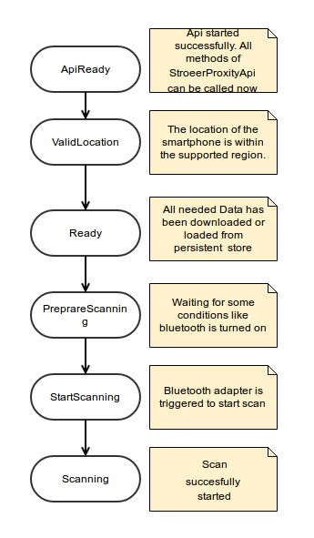

# Ströer Proxity SDK

## Purpose of the SDK
With the SDK you are scanning for so called blulocs. These are special beacons of the Favendo GmbH. This scanning can also be in the background, while your android application is not visible.

Scanning those blulocs enables you to:

1. receive enter and leave actions configured in your dashboard account
2. use it offline and fully featured

For scanned blulocs, the SDK automatically sends Analytics Events to allow monitoring the charge state in the dashboard.
It also sends an Analytics Event for each action that has been triggered by your application.

The SDK allows full offline functionality. You need to set up the SDK once correctly within your application to allow it to download all neccessary data. Once done, it can be set up without an internect connection next time.

There are two download strategies available:

1. "All" - This is the default approach which will download all relevant data from the server.
2. "Around Me" - With this approach every bluloc and all associated actions will be downloaded in a certain radius (1 km) around the current user location.

## Integrate the SDK into a project
In the zip file, which you can download, if you're having a valid dashboard account, you will find a demo application. That application shows how to set up the sdk-project.

Here is a quick guide that tells you what to do:

First add the following lines to the "build.gradle"-file of your root project
```bash
allprojects {
    repositories {
        jcenter()
        maven {
             url 'http://maven.match2blue.com/nexus/content/repositories/>type repository name here</'
            credentials {
                username '>type username here<'
                password '>type password here<'
            }
        }
    }
}
```
Then add the following lines to the "build.gradle"-file of the app-module. Be aware that you might have to update the version numbers according to the aars you found in the demo-application.
```bash
dependencies {
    compile('de.stroeer:stroeerProxitySdk:1.6.x-StripDown@aar')
        {
            transitive = true
        }
}
```

## Lifecycle


## Usage
### Prerequisites
To use the whole functionality of the SDK, it is neccessary to declare some permissions. This is already done by the sdks own Android-Manifest:
#### Needed hardware features
As the SDK needs to make extensive use of the bluetooth-feature, you need to set it as prerequisite for your app to function.
```bash
<uses-feature android:name="android.hardware.bluetooth_le" android:required="true" />
```
#### Predefined permissions by sdk
To start and stop scanning for bluetooth low energy devices:
```bash
<uses-permission android:name="android.permission.BLUETOOTH" />
```
To check if bluetooth is available and running:
```bash
<uses-permission android:name="android.permission.BLUETOOTH_ADMIN" />
```
To download data from the backend, which was configured in the dashboard:
```bash
<uses-permission android:name="android.permission.INTERNET" />
```
The SDK features automatic data-update after the internet connection got lost and than reconnects. To recognize those changes the following permissions are needed:
```bash
<uses-permission android:name="android.permission.ACCESS_WIFI_STATE"/>
<uses-permission android:name="android.permission.ACCESS_NETWORK_STATE"/>
```
To get an outdoor-position, the following permission is needed:
```bash
<uses-permission android:name="android.permission.ACCESS_FINE_LOCATION"/>
```
The sdk is also able to get an outdoor-position in the background. The fact, that the processor of the smartphone will "sleep" after a certain time, makes the following permission needed to wake it up.
```bash
<uses-permission android:name="android.permission.WAKE_LOCK" />
```
### Main Classes
As you can see in the demo-project which is delivered in the zip file, the important classes are StroeerProxityApi and Gateway.IGateWayListener.

StroeerProxityApi gives access to all functionality and settings of the StroeerProxitySDK.
The purpose of Gateway.IGateWayListener is to inform you about every event and change in status which is done inside of the StroeerProxitySDK.
After you created an instance of StroeerProxityApi you have to register an instance of Gateway.IGateWayListener with the usage of the registerGatewayListener-Method.

Creating an instance of StroeerProxityApi inside of the Application class is recommended for now, because in other cases it can happen to get a Leaked-ServiceConnection-Exception because the Context(Activity) was closed before the connection was unbound. The Feature to bind and unbind the connection manually will be available soon.
```bash
public class ShowCaseApplication extends Application {

    private static StroeerProxityApi stroeerProxityApi;

    @Override
    public void onCreate() {
        super.onCreate();
        stroeerProxityApi = new StroeerProxityApi(this, "BlulocTechdemo", "Im scanning
                     for blulocs.", R.drawable.icon, MainActivity.class);
    }

    public static StroeerProxityApi getStroeerProxityApi() {
        return ShowCaseApplication.stroeerProxityApi;
    }
}
```
Now register the Gateway.IGateWayListener and call resendCurrentState (See explanation below the code)
```bash
public class MyActivity extends Activity implements Gateway.IGatewayListener {

    public static final String SPHERE_NAME = "type sphere here";
    public static final String APP_KEY = "type appkey here";

    @Override
    protected void onResume() {
        super.onResume();
        MyApplication.getStroeerProxityApi().registerGatewayListener(this);
        MyApplication.getStroeerProxityApi().resendCurrentState();
    }

    @Override
    protected void onPause() {
        super.onPause();
        MyApplication.getStroeerProxityApi().unregisterGatewayListener(this);
    }

    @Override
    public void onMessage(StroeerProxityApi stroeerProxityApi, Message message, boolean isNew) {

    }

    @Override
    public void onStatusGained(StroeerProxityApi stroeerProxityApi, SdkStatus status, boolean isNew) {
        if (status == SdkStatus.API_READY){
            //If you got this Status you are able to use all functions of the StroeerProxityApi now
            MyApplciation.getStroeerProxityApi().setSphereNameAndAppKey(MyActivity.SPHERE_NAME, MyActivity.APP_KEY);
            //for correct authentication use spherename and appkey
        }
    }

    @Override
    public void onStatusRevoked(StroeerProxityApi stroeerProxityApi, SdkStatus status, boolean isNew) {

    }
}
```
Because this StroeerProxitySDK runs in a Service you have to wait until this service is up and running. For this you have to wait for the SDKStatus.ApiReady, which gets send in the onStatusGained-Method of the Gateway.IGateWayListener. Because it could be, that the service is started before you have registered the Gateway.IGateWayListener to the api  you have to trigger the StroeerProxityApi to send all status which have been sent till now. (StroeerProxityApi.resendCurrentState()). Now you are able to use all functionalities.

### Download Strategy: AroundMe
The DownloadStrategy.AROUNDME strategy should be used if you have a lot of blulocs and actions. With this approach every bluloc and all associated actions will be
downloaded in a certain radius (1 km) around the current user location. Region Monitoring is used to determine the location of the user.

To use the AroundMe-Strategy, call the following:
```bash
StroeerProxityApi.setDownloadStrategy(DownloadStrategy.AROUNDME)
```

## Further Information
For further informations the whole api is documented as JavaDoc. You can find this JavaDoc inside of the zip-file in folder documentation.
